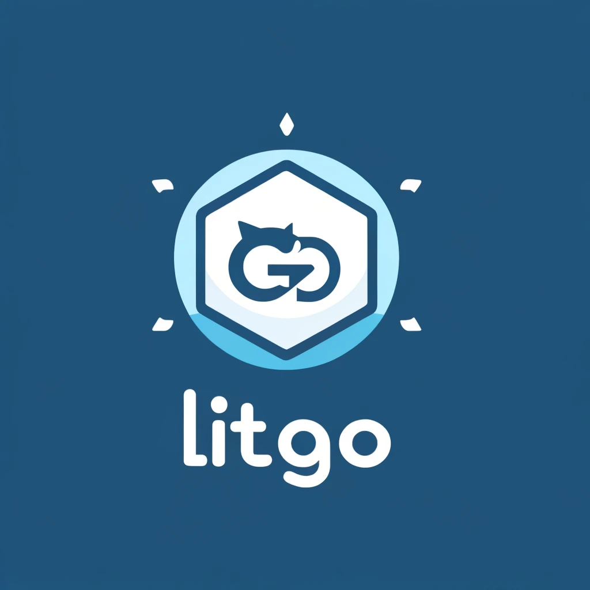

# Introduction ⚓️

Welcome to our lightweight and fun Go framework built on the MVC (Model-View-Controller) architecture. This framework is designed to help developers quickly build web applications with a clean and maintainable structure, ensuring an enjoyable development experience.

## Features 🚀

- MVC Architecture: Maintain a clean separation of concerns in your application.
- Hot-Reloading: Develop faster with real-time code reloading using Fresh.
- Docker Support: Easily build and run your application in a containerized environment.
- Swagger Integration: Automatically generate and view your API documentation.
- gRPC Support: Build high-performance microservices with gRPC. (Comming Soon)

## Instllation 🛠️

To get started with the framework, you have several options:

### Basic

Simply run the main.go file to start the application:

`go run main.go`

### Using Makefile

Alternatively, you can use the Makefile for convenience:
`make run`

### Hot-Reload with Fresh

The framework supports hot-reloading using Fresh. This allows you to see your changes in real-time without restarting the server. Use the following command:

`make hot`

## Unit Testing

To run unit tests, use Docker Compose. Note that unit testing can be tricky, and you might encounter errors. Here are the steps:

Run all tests using Makefile:

`make test-all`

Or, manually run tests inside the Docker container:

```shell
docker-compose -f docker-compose.dev.yml exec gptv_backend go test -v ./...
```

Every time you run **make hot** the swagger files will be regenared

## Docker

For development purposes, you can build and run the Docker image with hot reload using Fresh.

### Building

```shell
docker compose -f "docker-compose.dev.yml"  build
```

Run the dockers:

```shell
docker compose -f "docker-compose.dev.yml"  up
```

## Swagger

The framework includes integrated Swagger support for API documentation. You can access the Swagger UI at:

<http://localhost:8080/swagger/index.html>

This makes it easy to explore and test your API endpoints interactively.

## Contributing to Lite Go Core

I'm excited to have you contribute to Tiny Go Mvc! Your help in improving this lightweight and fun Go framework is invaluable. Here’s how you can get involved:

### Reporting Issues

If you find a bug or have a suggestion, please create an issue on our GitHub repository. Be sure to include as much detail as possible, including steps to reproduce the issue if applicable.

### Improving Documentation

We strive to keep our documentation clear and comprehensive. If you notice any gaps or areas that could be improved, please feel free to submit a pull request or suggest changes.
